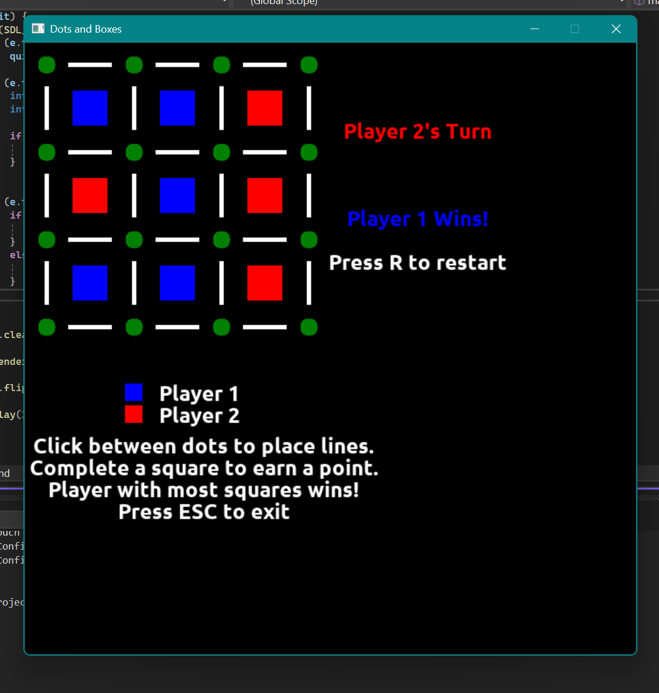

# Project 04 – Dots & Boxes
 
## 🕹️ Description

Dots and Boxes is a graphical implementation of the classic pencil-and-paper game using SDL2, SDL_ttf, SDL_mixer, and SDL2_gfx libraries. Two players take turns connecting adjacent dots with horizontal or vertical lines. Completing the fourth side of a box captures it and earns the player a point — and an extra turn. The game ends when all boxes are claimed. The player with the most boxes wins!
 
## 🎮 Controls
 
- Click between dots to place a line
- Press `R` to play again
- Press `Esc` to exit
 
## 🧪 Screenshot
 

 
## ✨ Extra Features
 
- 🎵 Immersive Sound Effects — Hear satisfying audio cues when:
	- A move is made
	- A box is completed
	- A player wins the game
- ✨ Smooth Animations — Lines and boxes animate into place as players make moves, adding a dynamic and polished feel to gameplay
- 👤 Turn Indicator — Clear, color-coded highlights show whose turn it is at all times